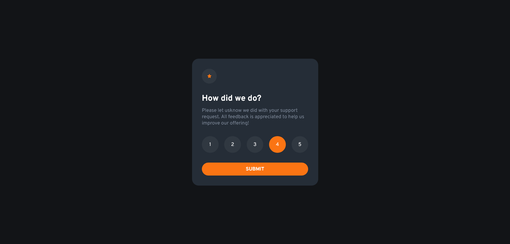
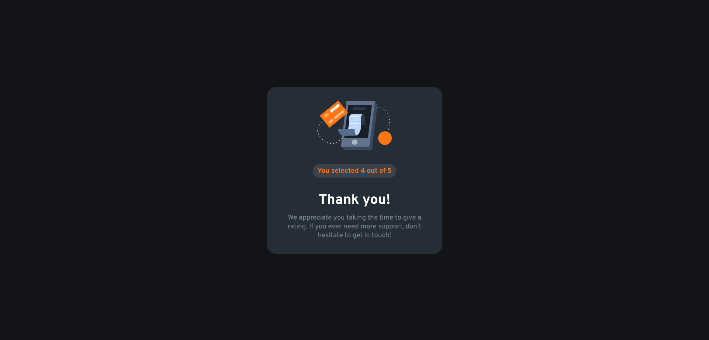

# Frontend Mentor - Interactive rating component solution

Essa é uma solução para o [Interactive rating component challenge do Frontend Mentor](https://www.frontendmentor.io/challenges/interactive-rating-component-koxpeBUmI).

## Table of contents

- [Visão Geral](#visão-geral)
  - [O Desafio](#o-desafio)
  - [Screenshot](#screenshot)
  - [Links](#links)
- [Meu processo](#meu-processo)
  - [Tecnologias](#tecnologias)
  - [O que eu aprendi](#o-que-eu-aprendi)
- [Autor](#autor)
- [Acknowledgments](#acknowledgments)

## Visão Geral

### O Desafio

Os usuários devem ser capazes de:

- Ver o layout ideal para o aplicativo, dependendo do tamanho da tela do dispositivo
- Ver os estados de foco para todos os elementos interativos na página
- Selecionar e enviar uma classificação numérica
- Ver o estado do cartão "Obrigado" após enviar uma avaliação

### Screenshot

### Links

- URL do site ao vivo: [Add live site URL here](https://your-live-site-url.com)

### Tecnologias

- HTML
- CSS
- Flexbox
- Javascript

### O que eu aprendi

Neste projeto pratiquei minhas habilidades com HTML, CSS e fixei meus conhecimentos em Javascript, com pequenas interações dinâmicas.
Trabalhei com eventos de clique, mostrando e escondendo elementos da forma que eu queria, adicionando e removendo classes, e mostrando uma mensagem dinâmica de acordo com a classificação escolhida no card.

## Autor

- Website - [Vinicius](https://github.com/viiniScript)
- Frontend Mentor - [@viiniScript](https://www.frontendmentor.io/profile/viiniScript)

## Acknowledgments

Layout e problema dispolibilizados gratuitamente pelo frontendmentor.